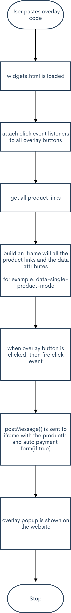
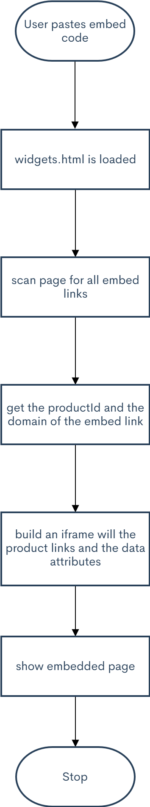

This project is written in Vanilla JS using TypeScript. Webpack is used for bundling the JS files.

**Steps to run this project**
```
    Step 1: Run `npm install`

    Step 2: Run `npm run build`

    Step 3: Run `npm run start``
```

Step 4: Open your browser and navigate to http://localhost:3000


This project contains two HTML files: 
1. index.html file
2. test-widgets.html file

In index.html file you can create an overlay or an embed element. A code will be generated for you depending on your selection - similar to Gumroad widgets. 

You would then need to copy this code and paste it in test-widgets.html in order to integrate the overlay/embed functionality.

For the purpose of this project, I am using two Gumroad products 
- https://gumroad.com/l/flashcard - which is a product I created &
- https://gumroad.com/l/pencil - which seems to be a test product


<h1> How it works? </h1>

In the src/public/classes folder, you'll find 4 classes that I created.

1. Widgets Class - This is the parent class. Although, it just has a domain property, in future more properties & methods  could be added.
2. Build Class - This class deals entirely with constructing the overlay and the embed code.
3. Overlay Class - This class deals with the creation of overlay iframe and communication b/w the website and the iframe.
4. Embed Class - This class deals with the creation of the embed iframes.

The below diagram should help in understandng the flow and the architecture of the system:

# Overlay Flow Chart


# Embed Flow Chart

